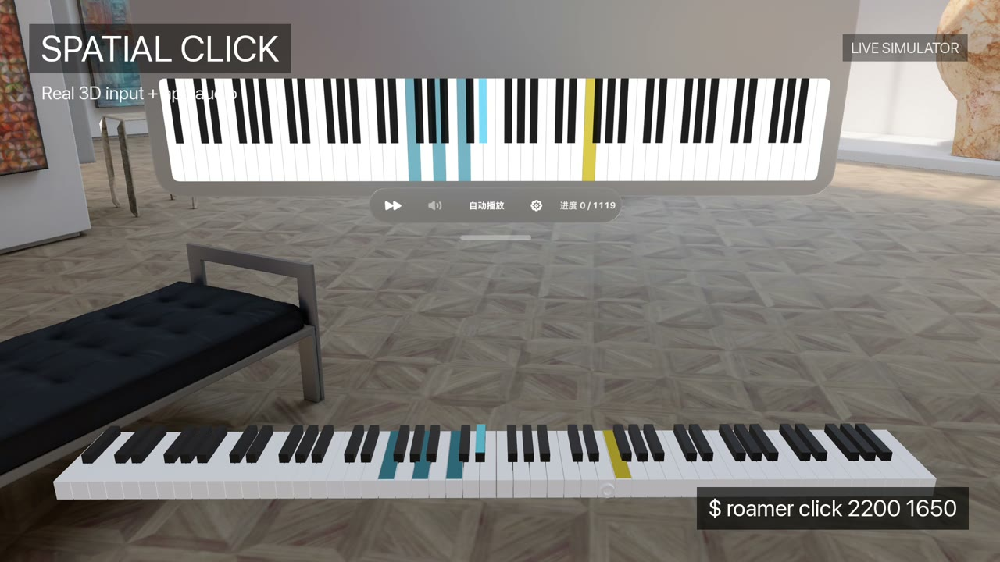
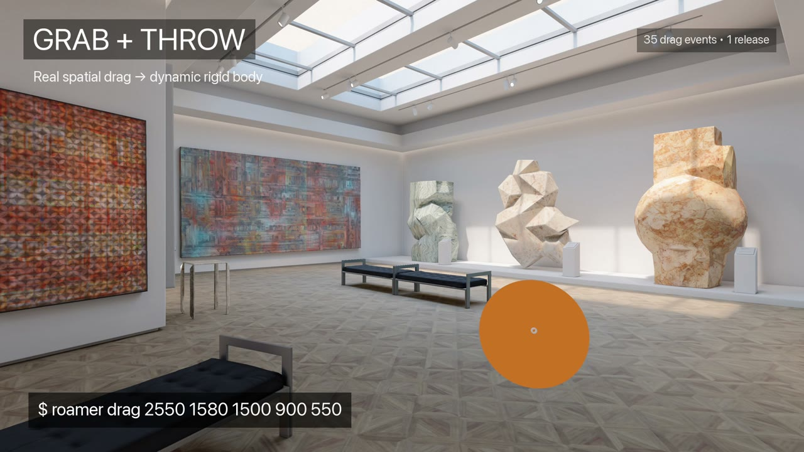

# Roamer

用命令行直接控制 Apple Vision Pro Simulator。

[English](README.md)

Roamer 可以在不操作 macOS 桌面 UI 的情况下自动化已经启动的 Apple Vision Pro Simulator：启动 App、发送空间与键盘输入、检查 Accessibility 和 RealityKit 状态，以及采集 Simulator 自身的音频和视频。

它**不会**移动 Mac 鼠标、发送宿主键盘输入、打开 Device Hub 或抢占焦点。

## Demo

<table>
<tr>
<td width="50%" valign="top">
<a href="https://github.com/chiimagnus/Roamer/releases/download/v0.1.0/Roamer-HappyPianist-Demo.mp4"></a><br>
<strong>HappyPianist · 3D 输入 + 音画录制</strong><br>
用 head pose 和空间点击控制 3D 钢琴；这段视频本身也由 <code>roamer record</code> 录制。
</td>
<td width="50%" valign="top">
<a href="https://github.com/chiimagnus/Roamer/releases/download/v0.1.0/Roamer-Museum-Demo.mp4"></a><br>
<strong>Museum · 6DoF 移动 + 抓取/抛掷</strong><br>
直接在 visionOS 自带 Museum 中移动和转向，再用 <code>roamer drag</code> 抓取并抛出 RealityKit 演示球体。
</td>
</tr>
</table>

点击任意预览图即可播放完整视频。

## 环境要求

- Apple Silicon Mac
- macOS 26.6+
- Xcode 27+
- visionOS 27+ Apple Vision Pro Simulator
- 当前只启动一个 Apple Vision Pro Simulator

Roamer 依赖 Xcode / Simulator 私有接口，不支持更早的 Xcode 或 visionOS Simulator 版本。

## 安装

```bash
brew install chiimagnus/tap/roamer
```

## 从源码构建

```bash
swift build -c release
.build/release/roamer --version
.build/release/roamer --help
```

以下示例假设 `.build/release/roamer` 已经可以通过 `roamer` 调用。

## 快速开始

启动 App，并等待 Accessibility 可用：

```bash
roamer launch <bundle-id>
roamer wait <bundle-id>
```

截图：

```bash
roamer screenshot /tmp/avp.png
```

直接使用这张**原始 PNG** 的像素坐标发送空间输入：

```bash
roamer click 900 700
roamer drag 900 700 1200 700
```

检查正在运行的 App：

```bash
roamer observe <bundle-id> /tmp/roamer-observe
roamer scene <bundle-id> /tmp/roamer-scene
```

录制 10 秒 Simulator 音画：

```bash
roamer record 10 /tmp/roamer-recording
```

完整命令语法以 `roamer --help` 为准。

## Roamer 能控制什么

- **App 生命周期：** `status`, `launch`, `wait`, `terminate`, `reboot`
- **空间输入：** `gaze`, `click`, `long-press`, `double-click`, `drag`, `magnify`, `rotate`
- **系统控制：** `home`, `pose`, `crown`, `indicator`
- **键盘：** `key`, `type`
- **检查与调试：** `screenshot`, `observe`, `press`, `scene`, `observe --debug`
- **采集与录制：** `audio status`, `audio capture`, `record`

## 坐标规则

空间手势只接受最新 `roamer screenshot` 原始图片的像素坐标。

不要使用：

- macOS 屏幕坐标；
- 图片查看器缩放后的显示坐标；
- Accessibility 的 `nativeFrame`；
- Scene XYZ 坐标或 Roamer 生成的 Scene 图片坐标。

head pose、窗口布局或场景发生变化后，应重新截图再取点。

## 当前限制

- Roamer 只控制 Apple Vision Pro **Simulator**，不控制真实 Apple Vision Pro。
- 最终空间命中仍由 visionOS hit-testing 决定，不能“点穿”前景窗口。
- `type` 当前只支持已验证的 visionOS English (US) 输入模式下的英文字母、数字和空格。
- Xcode 27 Apple Vision Pro Simulator 当前不支持通过 Roamer 发送 Command modifier。
- 私有接口不兼容时会明确失败，不会偷偷回退到 macOS 鼠标/键盘、旧数据或坐标猜测。

## 开发

开发者文档全部使用中文，并按功能划分。先读 [AGENTS.md](AGENTS.md)，它负责模块导航和真实 Simulator 验收入口。

基础验证：

```bash
swift test
swift build -c release
git diff --check
```

## License

AGPL-3.0。见 [LICENSE](LICENSE)。
